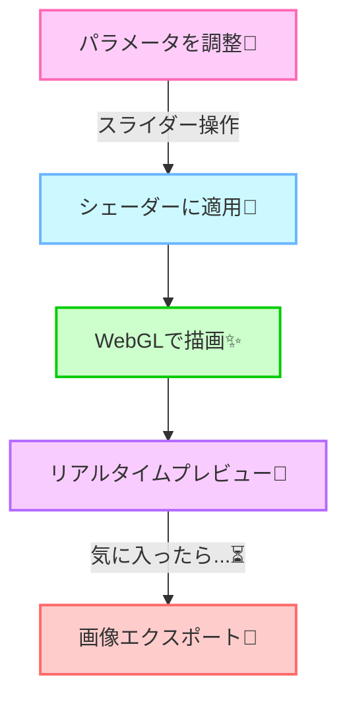
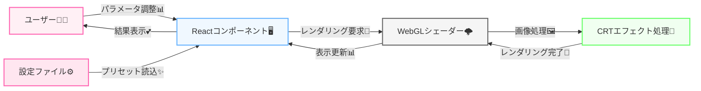

# ✨🌟 神CRTフィルター工房 🌟✨
マジ神レベルのCRTフィルターが作れちゃう超便利ツールだよん💁‍♀️💖

## どゆこと？🤔💭
レトロゲームとかむかしのテレビみたいな、あのビンテージな雰囲気のCRTフィルターが超簡単に作れちゃうの〜！🙌✨<br>
めっちゃ便利じゃん？リアルタイムでプレビュー見ながら設定いじれるし、最高のレトロ感が手に入る超優秀ツール👑💯<br>
<br>
ぶっちゃけ使い方シンプルすぎ😝<br>
1️⃣ パラメータをスライダーでいじるだけ📊👆<br>
2️⃣ リアルタイムでプレビュー画面に反映されるから調整超簡単！😘✌️<br>
3️⃣ お気に入りの設定ができたらエクスポートしちゃおう〜🎉🥳

## お試しデモサイトがこちら〜😍🔥
マジ使ってみて〜！ヤバいくらい便利だから！！🤳💕<br>
https://crt-filter-studio.pages.dev/

## 💫 最新リリース v1 💫
[2025/04/22]やったー！初めてのv1をリリースしたよ〜！🎊🚀<br>
超直感的なUIと高機能なフィルター設定で、マジでリアルなCRT体験が味わえるよ✨<br>
プレビュー画像も含めて全部カスタマイズできて、調整がめっちゃ楽しい🌡️👌<br>

## 超ウケる機能たち🤩💕
- CRTの曲面エフェクトを完全カスタマイズ⚡️
- スキャンラインの濃さも自由自在に調整できる💁‍♀️✌️
- グロー効果で懐かしい発光感を再現♡✌️😎
- カラーシフトやRGBずれの調整も超簡単💃🏻
- リアルタイムプレビューでその場で確認⏱️💨
- ✨NEW✨ プリセット機能で人気の設定をワンクリックで適用🔥💯

## 対応してるプレビュー画像📊🖼️
- デフォルトで用意したレトロゲーム風の画像が使えるよ🤙
- 自分の好きな画像もアップロードできるからマジ便利👵✨
- ※あんまり大きすぎる画像だとパフォーマンス落ちるから注意してね〜🙏💦

## 使ってる技術とか🛠️🔧
- Reactのフロントエンドで超軽快操作💪
- TypeScriptでコード品質バッチリ☁️⚡️
- ViteとESLintでモダン開発環境🔄
- WebGLシェーダーでCRTエフェクトを高速処理🧠
- Tailwind CSSで見た目もバッチリキマってる📑✨
- マジでモダンなUIでユーザー体験バツグン😍🎯

## 超わかりやすいフロー図♡🔄
マーメイド記法でアプリの流れを見せちゃう💁‍♀️✨



## システム構成図もかわいく💖



## パワーの秘密は？🤩💪
WebGLのフラグメントシェーダーをフル活用した最強アプリ！リアルタイムで複雑なCRTエフェクトを処理しながらも軽量な動作を実現✨⚡<br>
さらに、React+TypeScriptの最新技術で作られているから、コード品質も超高く、拡張性バツグンなの🔧💖

## 🔜 やることリスト（To Do）🔜
今後の進化計画はこんな感じ〜！💪✨
- 📱 スマホ対応をもっと強化！レスポンシブデザインでどんな端末でも使いやすく📊
- 🎮 ゲーム画面の動画にもフィルターをかけられる機能を追加予定💁‍♀️✨
- 🌐 コミュニティ機能で皆の作ったプリセットをシェアできるようにしたい👑

## 👩‍💻 開発者メモ 👨‍💻
シェーダーのパフォーマンス最適化についての重要なポイント💡

```glsl
// CRTエフェクトのフラグメントシェーダー例
uniform float curvature;      // 画面の湾曲度
uniform float scanlineOpacity; // スキャンラインの不透明度
uniform float brightness;     // 明るさ
uniform float contrast;       // コントラスト
uniform float noise;          // ノイズ量

// 湾曲効果の計算をメインループの外に出すと
// パフォーマンスが大幅に向上する
vec2 applyCurvature(vec2 uv) {
  // 計算ロジック...
}

void main() {
  // メイン処理...
}
```

###### ※いろんな設定試してみてね〜！リアルタイムでプレビューできるから楽しいよ😘🎶

## やらないこと🙅‍♀️🚫
WebGLの完全な互換性とかマジ無理〜！古いブラウザだとうまく動かないかもだけど、そこまでサポートする意味なくない？🤷‍♀️✨<br>
てかぶっちゃけ、今どきのブラウザならほぼ動くからオッケー😝💔

## 既知のバグとか注意点💥⚠️
ぶっちゃけ超安定してるけど、ま〜たま〜にこんなことあるかも👇<br>
⚡ めっちゃパラメータを極端な値に設定すると画面がチラついちゃうことがあるの〜😱💦<br>
<br>
これってさ〜、WebGLの処理が重くなりすぎて発生しちゃうの🌐🐢<br>
もし発生したら、ちょっとパラメータを調整してみてね〜！だいたいそれで直るから焦らないで✌️😘<br>
<br>
モバイル端末だとパフォーマンスが落ちる可能性もあるから、その時はエフェクトを軽めに設定してみてね💁‍♀️⏳